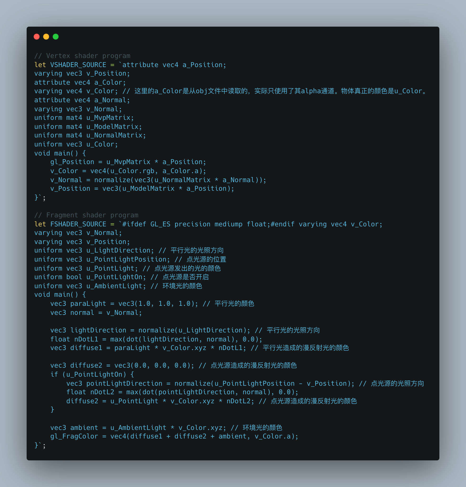
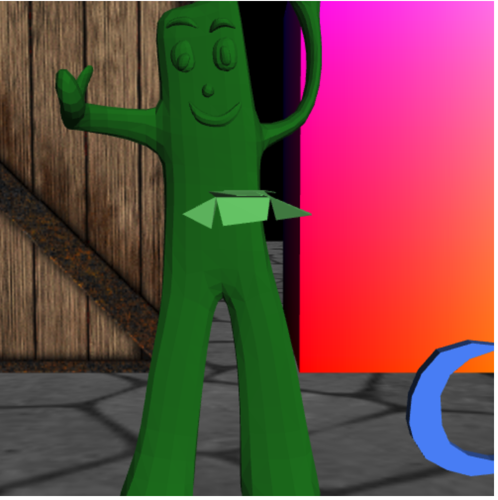
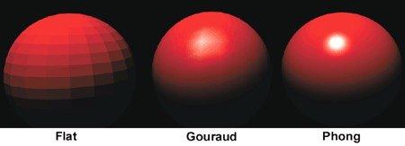

# 计算机图形学 Project 3

> 19302010021 张皓捷

## 项目目录文件及说明

```json5
├── 3DWalker.html // 主页面
├── 3DWalker.js // 主程序
├── BirdObject.js // 包含BirdObjectLoader类，用来绘制会动的小鸟
├── Camera.js // 照相机（单例）的实时参数和控制函数
├── Keyboard.js // 键盘控制器，注册keydown和keyup事件的回调函数
├── MyVector3.js // 三维向量类
├── Object.js // 包含ObjectLoader类，用来绘制静态的，从.obj文件中读取的模型
├── README.md
├── SimpleColoredObject.js // 包含SimpleColoredObjectLoader类，用来绘制渐变色正方体
├── Texture.js // 包含TextureLoader类，用来绘制纹理正方体和地面
├── image // 图片资源，用作纹理
│   └── ......
├── lib // 《WebGL编程指南》提供的库
│   └── ......
├── model // 模型资源，.obj文件
│   └── ......
├── objLoader.js // 《WebGL编程指南》提供的用来读取解析.obj文件的库
└── scene.js // 三维场景配置文件
```

## 运行环境和运行方法

- 运行环境：Chrome 112.0.5615.137
- 运行方法：将项目放到任意的Web服务器上，例如Tomcat或Nginx。启动服务器。假如服务器端口为8080，则在浏览器中输入`localhost:8080/3DWalker.html`即可查看到效果。

## 项目完成情况

完成了所有基本功能（需求文档中的2.1～2.8），完成了附加功能的Phong Shading，没有完成雾化效果和阴影效果。

## 开发过程中遇到的问题

- **问题1**：当相机移动时，绘制的渐变色正方体也跟着相机一起移动。
- 问题原因：相机移动后，相机的位置和方向发生了变化，但是却没有更新相应的ViewMatrix和ProjMatrix（视图矩阵和投影矩阵），导致出现问题
- 解决方法：每次根据最新的相机参数重新计算ViewMatrix和ProjMatrix，传入着色器中即可。
- **问题2**：点光源的位置不会随着相机的移动而移动。
- 问题原因：弄错了相机参数的存储位置。scene.js中的CameraPara只是相机的初始参数，相机的实时参数在Camera.js文件的Camera类的static属性中。
- 解决方法：使用Camera.eye, Camera.at等相机实时参数来计算点光源的位置，而不是使用CameraPara.eye, CameraPara.at，因为后者只是相机的初始参数。

## 小鸟的动画

小鸟的动画和助教给的Demo基本相同，即小鸟绕着海宝旋转飞行，高度根据旋转角的正弦值不断变化。

## 项目的亮点

完成了附加功能的Phong Shading。修改Object.js中的着色器代码如下，以在绘制从.obj文件导入的模型（海宝，五角星，蘑菇等）时使用Phong Shading。

每个三角形内部点的法向量是根据其三个顶点的法向量插值得到的（a_Normal插值得到v_Normal）。

但是观察数据以后，发现从.obj文件里读取出来的每个三角形的三个顶点的法向量居然是一样的（例如下图中，normal[0]，normal[1]，normal[2]是第一个顶点的法向量的三个分量，normal[3]，normal[4]，normal[5]是第二个顶点的法向量的三个分量，normal[6]，normal[7]，normal[8]是第三个顶点的法向量的三个分量，但是这三个顶点的法向量是一样的，以此类推）。因此插值得到的法向量也是一样的，导致Phong Shading的没有效果，看起来仍然像Flat Shading一样。


因为三角形三个顶点的法向量相同，所以渲染出来的效果仍然像Flat Shading一样，如下图所示。但是其实在shader里是实现了Phong Shading的，只是因为法向量相同，所以看起来像Flat Shading。




## 项目仍存在的缺陷

没有完成附加功能中的阴影和雾化效果。


